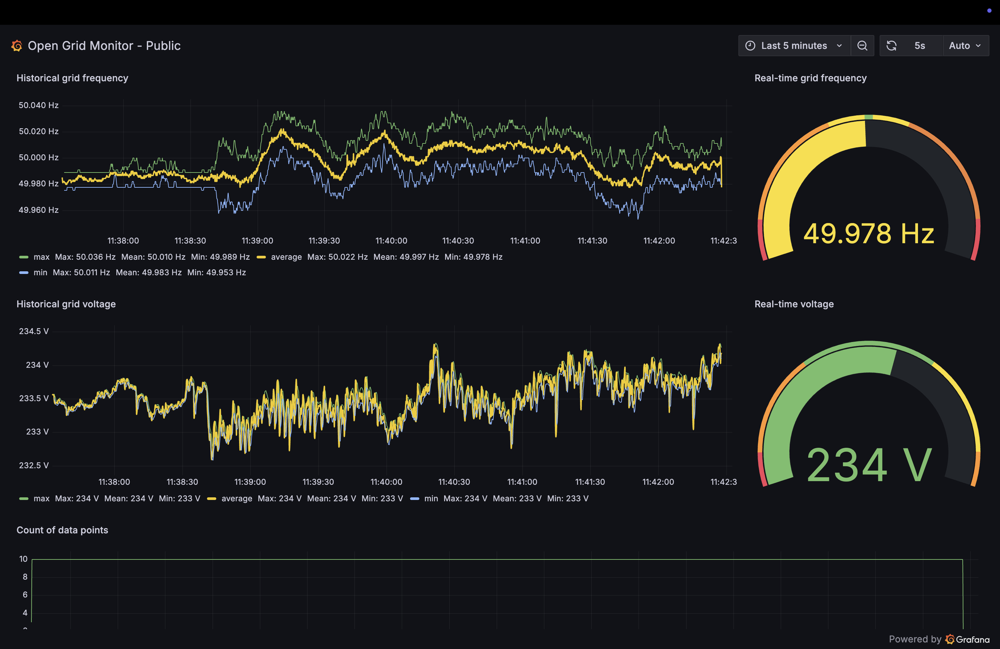

# Open Grid Monitor

A complete system for high-resolution electrical grid frequency monitoring and data collection, starting with the Continental European grid.

Check out the real-time dashboard [here](https://opengridmonitor.net/public-dashboards/ad3c54df59d0490daa6cfb120741d50b?refresh=auto)!



## Project Objective

The goal is to build a comprehensive database of electrical grid frequency measurements for research and analysis purposes. This project provides:

- **High-resolution frequency monitoring** - ESP32S3 hardware measuring every 20ms (every line cycle)
- **Complete infrastructure stack** - Containerized data collection, storage, and visualization
- **Open data initiative** - Monthly compressed datasets (Parquet/GZIP) published to GitHub for free public use
- **Code reference** - Complete embedded and infrastructure codebase for replication

Currently monitoring the Continental European grid from Milan, Italy, with plans to expand to other grid systems.

## System Overview

The system consists of two main components:

### 1. Hardware (Any Platform)
- Samples grid frequency
- Captures frequency variations with maximum possible resolution
- Publishes real-time data via MQTT
- Can use any hardware capable of frequency measurement

*This implementation uses ESP32S3 + ADE7953 from my [EnergyMe-Home](https://github.com/jibrilsharafi/EnergyMe-Home) project, but any hardware platform can be adapted for frequency monitoring.*

### 2. Infrastructure Stack
- **MQTT broker** (Mosquitto) - Device communication
- **Data collection** (Telegraf) - MQTT to database bridge  
- **Time-series database** (InfluxDB) - High-performance data storage
- **Visualization** (Grafana) - Real-time dashboards and analytics
- **Automated setup** - One-click deployment with Docker Compose

## Quick Start

### Hardware Setup
If you are using the ESP32S3 + ADE7953 combination, follow these steps:
```bash
cd firmware/esp32s3_ade7953
cp main/secrets_sample.h main/secrets.h
# Edit secrets.h with your WiFi/MQTT credentials
idf.py build flash monitor
```

### Infrastructure Setup
```bash
cd infrastructure
cp .env.example .env
# Edit .env with your credentials
./setup.sh
```

Access:
- **Grafana Dashboard**: http://localhost:3000
- **Device Web Interface**: http://[device-ip]
- **InfluxDB**: http://localhost:8086

## Data Collection

The system continuously collects:
- **Grid frequency** (Hz) measured at each line cycle for maximum resolution
- **Voltage RMS** (V) measurements at each line cycle
- **Device health metrics** (uptime, connectivity, etc.)
- **Timestamp precision** to millisecond level

This approach captures frequency variations at the finest possible granularity - one measurement per electrical cycle, providing unprecedented data resolution for grid analysis.

All data is stored in InfluxDB with full historical retention for analysis and export.

## Future Plans

### Open Data Repository
- Monthly automated exports of frequency data
- Compressed Parquet files with GZIP compression
- Automatic GitHub uploads for public access
- Standardized data format for research use

### Real-time Data Server
- Public API for live grid frequency access
- Multi-region monitoring network
- Grid stability analysis tools
- Research collaboration platform

## Contributing

This project aims to create a reference implementation for grid frequency monitoring. Contributions welcome for:

- Additional hardware platforms
- Grid monitoring in other regions
- Whatever improvements you can think of!

## Research Applications

High-resolution grid frequency data enables research in:
- Power grid stability analysis
- Renewable energy integration effects
- Load forecasting and demand response
- Grid interconnection studies
- Frequency regulation performance

## Hardware Requirements

- Any microcontroller or device capable of frequency measurement
- Grid connection interface (energy meter IC, ADC, etc.)
- Network connectivity (WiFi, Ethernet, etc.)
- MQTT client capability

*Reference implementation uses ESP32-S3 + ADE7953 from the [EnergyMe-Home](https://github.com/jibrilsharafi/EnergyMe-Home) project. See `firmware/esp32s3_ade7953/` for this specific implementation.*