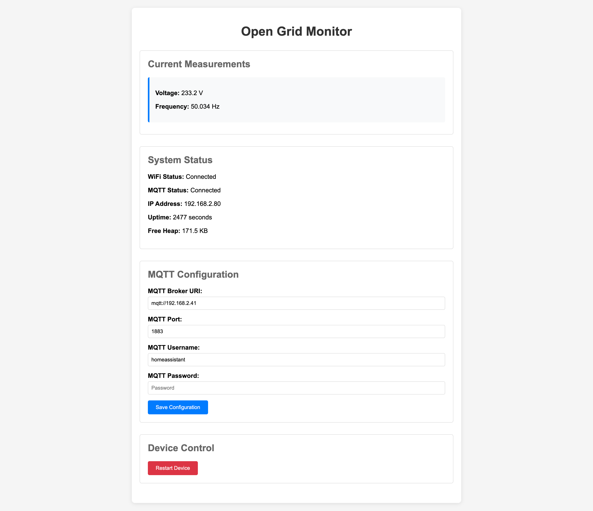

# ESP32S3 Grid Monitor Firmware

Firmware for the ESP32S3 that reads grid frequency and voltage from the ADE7953 chip at high frequency and sends data over WiFi.



## What it does

The device continuously monitors your electrical grid frequency and voltage:
- Samples every 20ms (50 times per second) to match 50Hz grid cycles
- Reads grid frequency and voltage RMS values
- Sends periodic measurements via MQTT
- Reports device status and health metrics
- Hosts a simple web interface for real-time monitoring

Data gets sent to your MQTT broker where the infrastructure stack picks it up for storage and visualization.

## Hardware

You need an ESP32-S3 connected to an ADE7953 energy metering chip via SPI. The specific pin connections are defined in the source code. A status LED shows what the device is doing.

## How it works

The firmware boots up, connects to WiFi, then starts a background task that reads frequency and voltage from the ADE7953 every 20ms. Valid readings (frequency 45-65Hz, voltage 50-300V) get queued and published to MQTT topics. A web server provides real-time access to current readings at the device's IP address. The device also listens for OTA update commands so you can push new firmware remotely.

### About the resolution of the measurements
According to the [ADE7953 datasheet](documentation/ade7953.pdf), the chip provides a period measurement of the voltage channel (= line voltage) updated once every line cycle. The measurement is based on a 223.75 kHz clock, which translates to a measurement resolution of 0.011 Hz at 50 Hz. To overcome this not-so-ideal resolution for this application, the period measurement is read every 20 ms such that averaging over tens of samples gives us a better measure, while still being very responsive to sudden changes in grid frequency.

## Setup

1. Install ESP-IDF and set up the environment
2. Copy `main/secrets_sample.h` to `main/secrets.h` and add your WiFi credentials
3. Build and flash: `idf.py build flash monitor`

## Configuration

Edit `main/secrets.h` with your network credentials. The device creates a unique ID from its MAC address and publishes to topics like `open_grid_monitor/{device_id}/measurement`.

### MQTT Topics

The device publishes to several MQTT topics:
- `open_grid_monitor/{device_id}/measurement` - Grid frequency and voltage data
- `open_grid_monitor/{device_id}/status` - Device status and health metrics
- `open_grid_monitor/{device_id}/logs/{level}` - Log messages by level (info, warning, error)
- `open_grid_monitor/{device_id}/system` - System information broadcasts
- `open_grid_monitor/{device_id}/responses/ota` - OTA update responses
- `open_grid_monitor/{device_id}/responses/restart` - Restart command responses

Command topics (device listens on these):
- `open_grid_monitor/{device_id}/commands/ota` - Trigger OTA updates
- `open_grid_monitor/{device_id}/commands/restart` - Restart device

### HTTP REST API

The web interface also exposes REST endpoints:
- `GET /` - Main web interface
- `GET /api/status` - Current device status and latest measurements (JSON)
- `GET /api/config` - Device configuration
- `POST /api/config` - Update device configuration
- `POST /api/restart` - Restart device
- `POST /upload` - Upload firmware for OTA update

## Updates

Use the Python OTA tool to push firmware updates:
```bash
python tools/mqtt_ota_update.py --automatic
```

The device will download and install new firmware without needing physical access.
